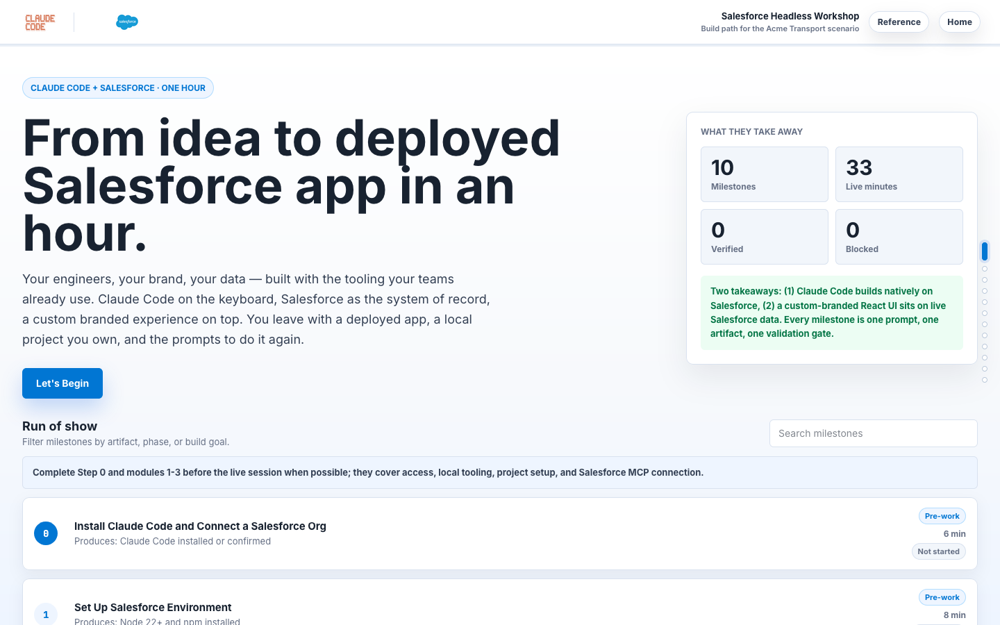
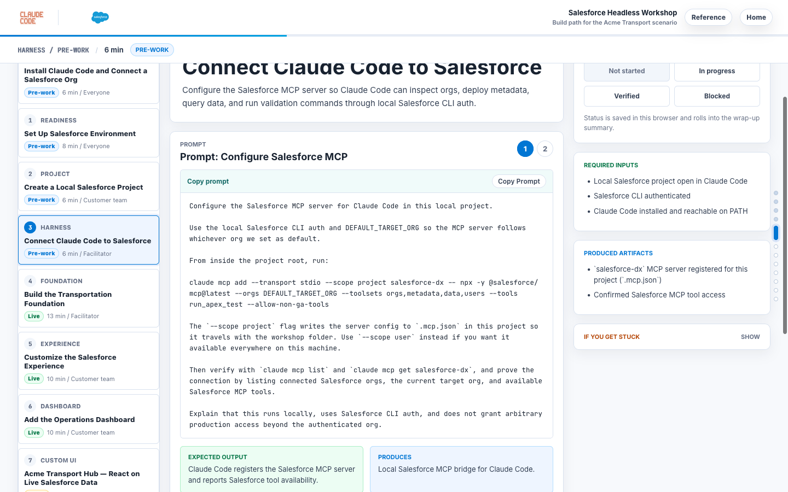

# Salesforce Headless Workshop

> Build a custom-branded React app on live Salesforce data in under an hour, end-to-end, with Claude Code on the keyboard.

**🔗 [Try the live demo →](https://sf-headless-workshop-claude-d4c4dbba8d08.herokuapp.com/)**



This repo is a workshop microsite (Vite + React) plus a copy-ready prompt library that walks an agent through an end-to-end build path — from environment setup all the way to a custom-branded React app deployed onto Salesforce via the Multi-Framework beta, plus a record-triggered Flow that propagates one Salesforce write to two surfaces with no middleware.

The scenario is **Acme Transport** — carriers, shipments, exception cases — kept deliberately generic so the build patterns translate to whatever vertical your team is in.

## What you'll build

| # | Mode | Phase | Outcome | Target Time |
|---|---|---|---|---:|
| 0 | Pre-work | Access | Install Claude Code and connect a Salesforce org | 6 min |
| 1 | Pre-work | Readiness | Verify Node 22+, Salesforce CLI v2.130.7+, skills, and Developer Edition access | 8 min |
| 2 | Pre-work | Project | Create a local Salesforce project | 6 min |
| 3 | Pre-work | Harness | Connect Claude Code to Salesforce through MCP | 6 min |
| 4 | Live | Foundation | Generate Carrier, Shipment, Case fields, permissions, and seed data | 13 min |
| 5 | Live | Experience | Create the Lightning app shell, tabs, and list views | 10 min |
| 6 | Live | Dashboard | Add the Transportation Operations dashboard and `shipmentTracker` LWC | 10 min |
| 7 | Bonus | Custom UI | Deploy a React **Acme Transport Hub** on the Multi-Framework beta against live Carrier/Shipment data | 7 min |
| 8 | Bonus | Automation | Build a record-triggered Flow that auto-creates an exception Case routed to a queue | 10 min |

The Flow in milestone 8 is the headline demo: one Salesforce write propagates instantly to both the Lightning dashboard from milestone 6 and the React Transport Hub from milestone 7.

Each milestone card carries a copy-ready prompt, expected artifacts, validation commands, and a recovery path.



## What you'll learn

- **Claude Code harness mechanics** — local agent loop, MCP server bindings, prompt → tool → file flow.
- **Salesforce CLI + skills** — using [`forcedotcom/sf-skills`](https://github.com/forcedotcom/sf-skills) workflows for objects, fields, LWC, FlexiPage, Flow, deploy, and data.
- **Multi-Framework React beta** — scaffolding a UI bundle, deploying via `sf project deploy start`, and reading live Salesforce data through `@salesforce/sdk-data` and the GraphQL UI API.
- **Prompt engineering for build agents** — dry-run guardrails, deploy sanitization, layout idempotency, FLS-before-seed ordering.
- **Platform trial workflow** — the React beta runs in a Salesforce Platform trial today (Developer Edition picks it up at Summer '26 GA on July 9, 2026); the workshop covers signup, `test.salesforce.com` auth, and the one-time Multi-Framework Setup toggle.

The build patterns — preflight, dry-run guardrails, FLS-before-seed ordering, layout sanitization, deploy → assign → seed → verify — translate cleanly to any agent harness with shell + file tools (Cursor, Claude Code, Aider, Cline). Claude Code is the reference implementation because it's what the workshop was validated against, but the prompt library and milestone shape are harness-agnostic.

## Quickstart

```bash
git clone https://github.com/ejochims/salesforce-headless-workshop-claude.git
cd salesforce-headless-workshop-claude
npm install
npm run dev
# open http://localhost:3000
```

Then:

1. Open Claude Code ([install instructions](https://docs.claude.com/en/docs/claude-code/overview)). For a smoother live demo, launch with `claude --permission-mode acceptEdits` so file edits and shell commands auto-approve through the multi-step build milestones.
2. Run **Milestone 0 (Preflight)** from the app's prompt library or [`prompts/00-preflight.md`](./prompts/00-preflight.md).
3. Work through the milestones in order. Each ends with a validation gate — paste the Claude Code output into the workshop UI's status tracker and you'll get an exportable evidence report at the end.

## Tech stack

- React 18 + Vite + TypeScript (workshop microsite)
- Express server with `npm run build && npm start` — deployable to any Node host
- Mermaid diagrams + Shiki code highlighting
- The deployed React-on-Salesforce milestone uses the Salesforce Multi-Framework beta with `@salesforce/sdk-data` + GraphQL UI API

## Adapting for your scenario

The Acme Transport scenario is intentionally generic so the patterns transplant. To rebrand for your own customer or vertical, see [`CUSTOMIZE.md`](./CUSTOMIZE.md). It covers:

- The customer story (carriers/shipments → whatever your domain uses)
- Brand swap (colors, header, app name)
- Permission set + queue API names
- Prompts and validation scripts

## Deploy

The microsite is a vanilla Express + Vite app — anywhere `node` runs, this runs. The build command is `npm run build` and the start command is `npm start` (which runs `node dist/index.js`). Set `NODE_ENV=production` so the server serves the static build instead of Vite middleware.

A few common options:

- **Heroku** — `app.json` and `Procfile` are already in the repo. `heroku create && git push heroku main` deploys it; the buildpack picks up Node automatically.
- **Vercel** — connect the repo, set the build command to `npm run build` and the output directory to `dist/public`. The Express server isn't strictly needed if you just want the static workshop UI; for the SPA-only path, point Vercel at `dist/public/` after build.
- **Railway / Render** — both auto-detect Node. Build command `npm run build`, start command `npm start`, set `NODE_ENV=production`.
- **Fly.io** — `fly launch` detects Node; accept the defaults. The same `npm run build && npm start` lifecycle works inside the generated Dockerfile.
- **Self-hosted / VPS / Docker** — `npm ci && npm run build && NODE_ENV=production node dist/index.js` is enough. Front it with whatever reverse proxy you prefer.

The microsite holds no Salesforce credentials and makes no Salesforce calls — it's a presenter UI that displays prompts and tracks status. So the deployment surface is small and the only env var you need is `PORT` (defaults to 3000).

## Credits

- [`forcedotcom/sf-skills`](https://github.com/forcedotcom/sf-skills) — official Salesforce coding-agent skill library used throughout the build milestones.
- [`dylandersen/sf-multiframework`](https://github.com/dylandersen/sf-multiframework) — Multi-Framework React beta skill that hardens milestone 7.
- [Claude Code](https://docs.claude.com/en/docs/claude-code/overview) — Anthropic's agentic coding CLI used to drive the workshop.

## Repository layout

```text
client/                   Workshop microsite (React + Vite)
server/                   Express server (static serving in production, Vite middleware in dev)
prompts/                  Source prompt library, one file per milestone
scripts/                  Validation scripts referenced by milestones
labs/                     Post-workshop continuation modules
public/assets/brand/      Visual assets (Claude Code + Salesforce logos)
docs/screenshots/         README screenshots
force-app/                Empty SFDX shell for the workshop (filled by Claude Code at runtime)
```

## License

MIT — fork it, use it, rebrand it.
